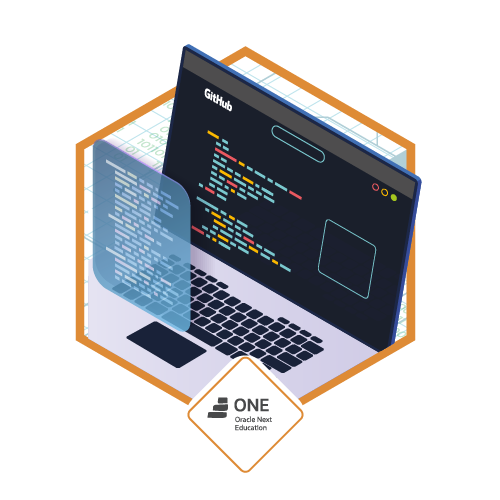

<h1>Formação Back-end Oracle & Alura</h1>

<h1>Formação: Especialização Back-End Ministrado em 341h pelas Intituíções Oracle & Alura</h1>
Programa de ensino iniciado em 23/11/2022, período final 26/05/2023

<h2>Formação Desenvolvimento Pessoal - 38h - T4 - ONE - Concluído em 19/01/2023 ✅</h2>

<h4>Aprenda como melhorar a sua produtividade e seu desenvolvimento pessoal.</h4>

Produtividade no dia a dia
A Formação em Produtividade é um guia de aprendizado completo para aprimorar os seus hábitos. A princípio, você vai aprender métodos que te ajudam a criar bons hábitos e produtividade. Além disso, você vai descobrir como melhorar a sua eficácia profissional e técnicas que vão melhorar sua gestão de tempo.

Manter um alto nível de produtividade contribuirá na sua gestão de carreira e vai melhorar a sua produtividade. Um dos primeiros objetivos que os profissionais buscam para melhorar é sua produtividade é se preparar para realizar um grande projeto, gerenciar uma tarefa simples ou apenas reduzir o trabalho que acumula dia a dia.

<h4>PRODUTIVIDADE PARA O DIA-A-DIA</h4>

Por diferentes motivos, profissionais enfrentam problemas de produtividade, o que pode impactar negativamente no desenvolvimento de tarefas chaves relacionados ao negócios a que se dedicam. Portanto, é fundamental criar um repertório de bons hábitos para melhorar a sua produtividade.

<h4>POR QUE CRIAR BONS HÁBITOS É IMPORTANTE?</h4>

Trabalho e rotina podem acontecer em um ritmo em que você se sente sobrecarregado e esquece quais são suas verdadeiras prioridades de trabalho. Uma das vantagens de criar bons hábitos é que você terá acesso a estratégias de como tornar o seu trabalho mais efetivo e assim evitar situações que comprometam a sua produtividade.

<h4>POR QUE DEVO ESTUDAR SOBRE PRODUTIVIDADE?</h4>

Quanto mais consciência você tiver sobre seus hábitos e sobre a qualidade desses hábitos, melhor será a sua relação com a produtividade, justamente porque você saberá o que pode fazer para melhorar suas entregas e priorização de tarefas, por exemplo.

<h4>COMO APRENDER SOBRE PRODUTIVIDADE?</h4>

Para aprender sobre produtividade é importante que você estude e pratique muito, já que é uma competência fundamental em todas as áreas profissionais. Sendo assim, é importante que você desenvolva sua capacidade de se adaptar a novas situações, de definir prioridades e como ser mais produtivo. É preciso saber também como a gestão de tempo pode melhorar a sua eficiência, a Formação da Alura vai te preparar para tudo isso.

<h2>Formação Iniciante em Programação - 71h - T4 - ONE - Concluído em 20/01/2023 ✅</h2>

O caminho das pedras para entrar no universo da programação e começar com a criação de sites utilizando as linguagens populares CSS, HTML e JavaScript.

Conheça esta Formação!
Se você não conhece nada de programação e desenvolvimento de software, mas deseja entrar nessa área onde o mercado de trabalho está superaquecido, a formação Iniciante em programação é para você!

Você vai criar suas primeiras páginas web, utilizando HTML, CSS, JS e assim aprender lógica de programação junto com as linguagens de programação mais utilizadas no mundo.

Se você trabalha em outras áreas como marketing digital, experiência do usuário (UX), design, ou áreas correlatas, essa formação te ajudará a entender melhor como a área de tecnologia funciona e, assim, você consegue se comunicar melhor com a área de desenvolvimento.

<h2>Formação Business Agility - 27h -T4 - ONE - Concluído em 04/02/2023 ✅</h2>

Prepare sua organização para a transformação ágil, sua empresa sendo ágil

Estamos vivendo em um mundo onde as empresas precisam se reinventar a cada dia. Novas formas de trabalhar são criadas, novos modelos de negócios surgem, novos desafios aparecem no dia a dia das empresas.

<h4>O que é business agility?</h4>

Business Agility (agilidade comercial, em tradução livre) é a capacidade que as empresas podem desenvolver para se adaptar rapidamente às mudanças, entregando valor para seus clientes.

<h4>Por que Business Agility é importante?</h4>

Na Formação Business Agility você vai aprender como sua empresa pode se preparar para este cenário de incertezas e mudanças constantes, entender qual é o Mindset Ágil que as empresas precisam, como estruturar times ágeis e como mensurar resultados tanto para o negócio como para a operação.

Por fim, quando Agile começa a dar resultados para a empresa, precisamos formar novos Agile Coaches para a nossa organização e além disso, precisamos aprender a escalar esse ambiente de agilidade para outros projetos e áreas.

<h2>Formação Java e Orientação a Objetos - 66h - T4 - ONE - Concluído em 31/03/2023 ✅</h2>

Aprenda a usar uma das linguagens mais populares no desenvolvimento back-end, mergulhe no paradigma da orientação a objetos e domine as principais bibliotecas do mundo Java.

<h4>Sobre o Java;</h4>

Java é uma das linguagens de programação mais usadas no mundo, segundo o famoso ranking da TIOBE. É uma linguagem orientada a objetos, multiplataforma e bastante completa por permitir a criação de um programa único para uso em diversas plataformas. A plataforma Java ganhou muitos mercados diferentes - da web ao desktop em grandes empresas e governos, passando por mobile e IoT mas o grande mercado Java hoje ainda é o back-end em sistemas Web.

A formação Java da Alura é um guia de aprendizado completo para você iniciar uma carreira na programação Java. Você vai aprender desde os fundamentos da linguagem com as boas práticas até o conhecimento essencial para uma boa modelagem orientada a objetos.

<h2>Formação Empreendedorismo - 46h - T4 - ONE Concluído em 15/04/2023 ✅</h2>

Habilidades para um mercado moderno, nem só de programação é feito o mercado de tecnologia.

Habilidades empreendedoras, organização pessoal e trabalho em equipe também são fundamentais.

<h2>Formação Java e Spring Boot - 90h - T4 - ONE</h2>

A Formação Java e Spring Boot é um guia de aprendizado completo para você iniciar uma carreira bem sucedida na programação Web Java. O pré-requisito é a formação Java ou conhecimentos sólidos na linguagem Java e o paradigma Orientado a Objetos.

Atualmente, o Spring Framework é o framework mais usado no mercado e você será introduzido ao poder do framework. O mercado é muito focado em APIs, principalmente o mercado Java, por isso veremos como criar uma API baseada nos princípios REST, com camadas de segurança, usando o Spring Boot e JWT.

<h2>Complementar Back End T4 - ONE</h2>

Formação com conteúdos complementares para seus estudos em Back End

